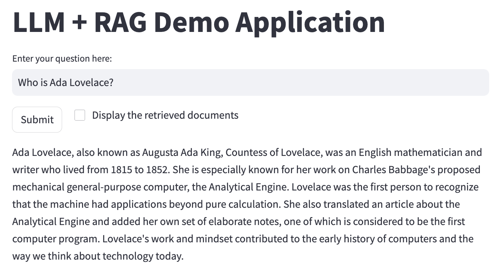

In this project, we create a simple Streamlit app to demonstrate an LLM + Retrieval Augmented Generation (RAG) application. The goal is to answer user queries using 
additional input documents (wiki pages about scientists in our case). The workflow is as follows:

1. Load and index the documents using ChromaDB. The default embedding model is `all-MiniLM-L6-v2`.
2. Enter the query
3. The query is used to retrieve the top N documents from the collection (R)
4. The retrieved documents are re-ranked using the Cross-Encoder model
5. The top-ranked document(s) are used as a context for the LLM model (AG).

I utilised the OpenAI API to generate the answers. The model is `gpt-3.5-turbo`. So make sure that your key is available in the environment variable `OPENAI_API_KEY`.

Even though I used a public data source that probably exists in the model itself, the same approach can easily be applied to your own (private) data to extract and answer questions from any documents. 

#### Installing the requirements

```bash
pip install -r requirements.txt
```

#### Running the application
```bash
python -m streamlit run app.py
```

#### How does it look like?

